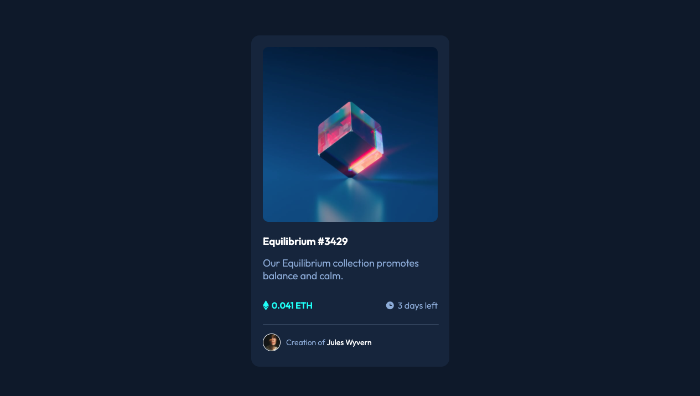

# Frontend Mentor - NFT preview card component solution

This is a solution to the [NFT preview card component challenge on Frontend Mentor](https://www.frontendmentor.io/challenges/nft-preview-card-component-SbdUL_w0U). Frontend Mentor challenges help you improve your coding skills by building realistic projects. 

## Table of contents

- [Overview](#overview)
  - [The challenge](#the-challenge)
  - [Screenshot](#screenshot)
  - [Links](#links)
- [My process](#my-process)
  - [Built with](#built-with)
  - [What I learned](#what-i-learned)
  - [Useful resources](#useful-resources)

## Overview

### The challenge

Users should be able to:

- View the optimal layout depending on their device's screen size
- See hover states for interactive elements

### Screenshot

### Links

- [Github repo URL](https://github.com/andlerar/nft-preview-card-component-main)
- [Live Site URL](https://andlerar.github.io/nft-preview-card-component-main/)

## My process
Started with setting up the HTML first, and from there I added the colors with CSS variables, and the layout using Flexbox.
Made the desktop version first and then adjusted the mobile view, should I have done it again I would have started with the mobile view.
After the card was made, I refactored as much of the code as possible to clean up and make the code more readable, especially because I added `display:flex;` on too many elements to start with.

### Built with

- Semantic HTML5 markup
- CSS custom properties
- Flexbox

### What I learned

I used this project as an opportunity to learn and practice **CSS Flexbox**

### Useful resources

- [Flexbox Froggy](https://flexboxfroggy.com/)
- [W3 schools](https://w3schools.com)
- [Mdn Web Docs](https://developer.mozilla.org/)
- The browser inspector
